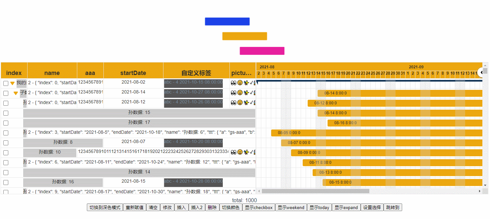

# JzGantt


  
   
 

[[English](./README.md)] [[中文](./README_cn.md)]

基于vue3的一个简单的甘特组件。
 

## 截图



## 什么是 JzGantt

- [x] 根据日期自动生成甘特图
- [x] 支持多层扩展
- [x] 高性能
- [x] 多层联动
- [x] 支持自定义表内容
- [x] 支持自定义甘特内容
- [x] 支持自定义表头
- [x] 动态更新数据
- [x] 定制任意风格
- [x] 支持黑暗模式
- [x] 支持多种日期显示模式切换
- [ ] 更多持续更新

## 文档

要查看源码，参见 [Github](http://github.com/jeremyjone/jz-gantt)

有关更详细的文档，参见 [document web](https://docs.xiaopangying.com/gantt/)

要看示例，参见 [example web](https://docs.xiaopangying.com/gantt-demo/)

如果遇到任何问题，请提 [issue](https://github.com/jeremyjone/jz-gantt/issues).

## 如何使用

### 安装

```bash
npm install jz-gantt --save
// or
yarn add jz-gantt  // 推荐
```

### 使用

```js
import Gantt from "jz-gantt";
import "jz-gantt/dist/index.css";

createApp(App).use(Gantt).mount("#app");
```

### 基本用法

`Data` 应该是 `Array<any>` 类型，`index`，`startDate`，`endDate`和`children` 应该在 `Data item` 中，它们有助于正确显示数据。当然，每一个字段都可以自定义。

```js
const dataList = [
  {
    index: 1,
    startDate: "2020-06-05",
    endDate: "2020-08-20",
    ttt: {
      a: "aaa",
      b: "bbb"
    },
    name: "mydata1",
    children: []
  },
  {
    index: 2,
    startDate: "2020-07-07",
    endDate: "2020-09-11",
    ttt: {},
    name: "mydata2",
    children: [
      {
        index: 3,
        startDate: "2020-07-10",
        endDate: "2020-08-15",
        ttt: {
          a: "aaa"
        },
        name: "child1",
        children: []
      }
    ]
  }
];
```

```html
<j-gantt data-index="index" :data="dataList" />
```

### 使用列插槽组件

我们提供了一个名为 `JGanttColumn` 的插槽。 `Label` 是必需的，它应该匹配数据的属性键名。

```html
<j-gantt data-index="index" :data="dataList">
  <j-gantt-column label="name" />
</j-gantt>
```

### 使用滑块插槽组件

我们提供一个名为 `JGanttSlider` 的插槽。如果传入多个滑块，有且只有最后一个滑块将被渲染。

```html
<j-gantt data-index="index" :data="dataList">
  <j-gantt-slider />   <!-- no render -->
  <j-gantt-slider />   <!-- will be rendered -->
</j-gantt>
```

## 许可证

[MIT](./LICENSE)
